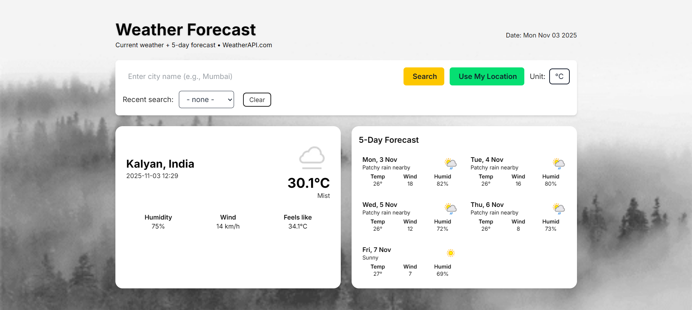
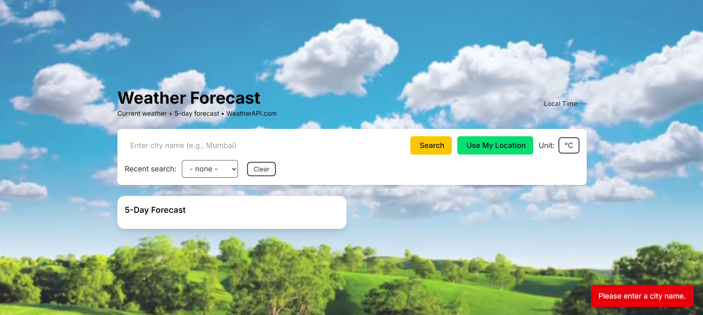
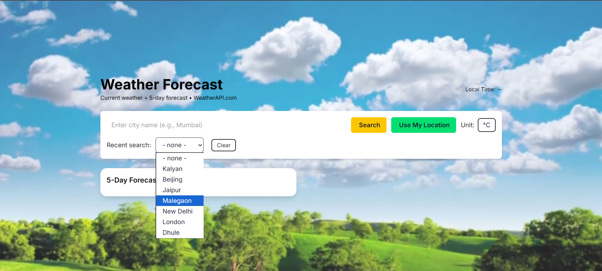
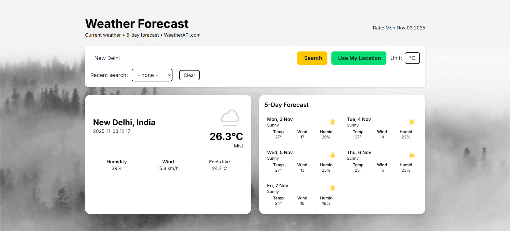

# Weather Forecast Application

Complete front-end Weather Forecast application built with HTML, Tailwind CSS and JavaScript.
This app fetches current weather + 5-day forecast from WeatherAPI.com.

## Features
- Search weather by city name.
- Use current device location (Geolocation).
- Recently searched cities from dropdown.
- Use of local storage for cities.
- Input validation and custom error popups.
- Display: city, country, local time, current temperature, condition, humidity, wind, feels-like.
- 5-day extended forecast (date, average temp, wind, humidity, icon).
- Temperature toggle (°C / °F) 
- Custom UI warnings/alerts for extreme temperatures (>= 40°C or <= -10°C).
- Dynamic background (sunny/cloudy/rainy/snow/clear/mist) based on the weather condition.
- Responsive UI for desktop, tablet, and mobile.

